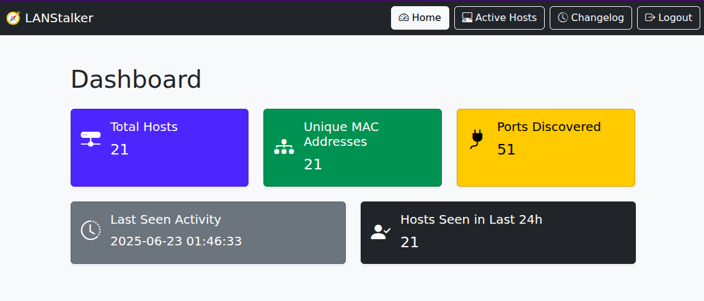
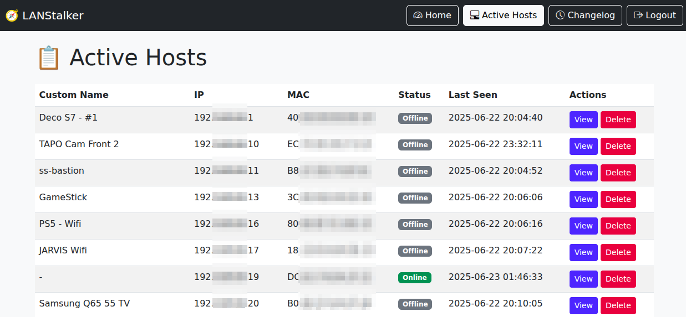
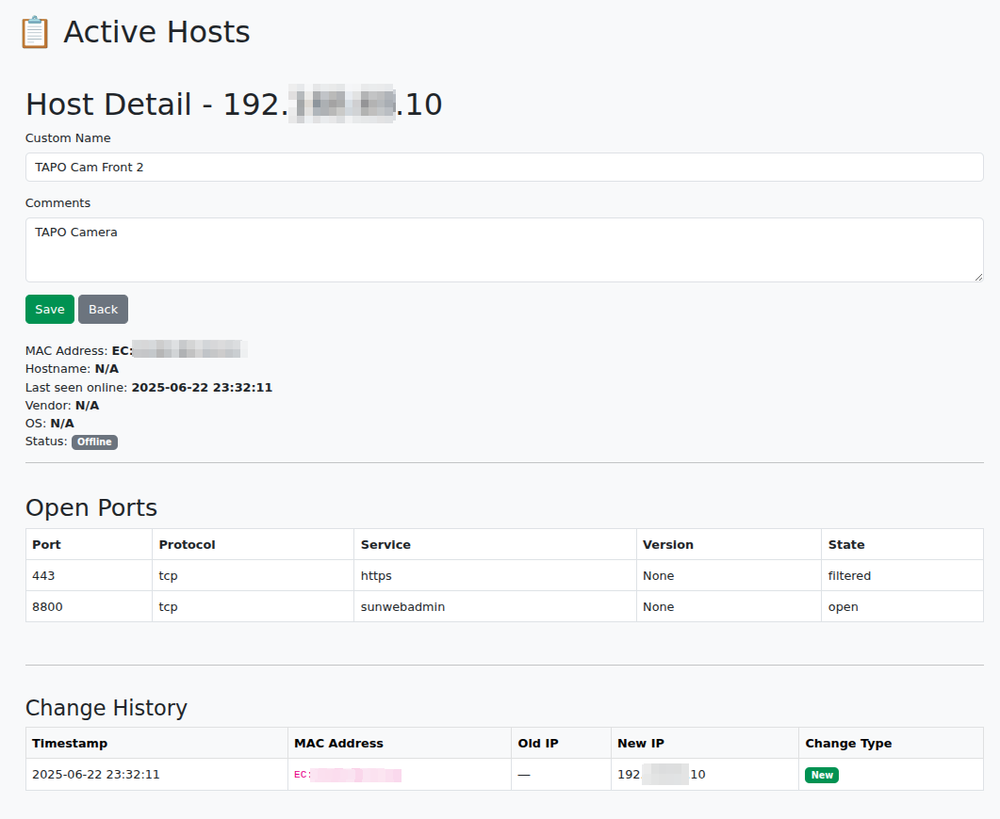

# LANStalker

**LANStalker** is a lightweight network monitoring tool that continuously scans your local network for active hosts, tracks their IP/MAC assignments, and displays results through a web interface. It uses Nmap under the hood for detection and integrates with a SQLite database to persist host data over time.

---

## 🧩 Features

- Passive and active discovery of LAN hosts via Nmap.
- Tracks MAC addresses as unique identifiers (even if IP changes).
- Stores host info (IP, MAC, hostname, OS, vendor) and open ports.
- Detects new devices and changes in IP addresses.
- Web dashboard to browse hosts, view port details, edit comments, and review changelogs.
- Dockerized setup with separate containers for scanner and web interface.

---

## 📷 Preview

### Dashboard


### Active Hosts


### Host Details



---
## 🚀 Getting Started

### Prerequisites

- Docker & Docker Compose
- Access to your local network interface (scanner uses `network_mode: host`)

### Clone the repo

```bash
git clone https://github.com/hernancollazo/lanstalker.git
cd lanstalker
```

### Environment Configuration

Create a `.env` file in the root with:

```ini
NETWORK_SEGMENT=192.168.1.0/24
SCAN_FREQUENCY=300
DB_PATH=/db/network.db
XMLS_PATH=/xmls
SECRET_KEY=CHANGE_ME
ADMIN_PASSWORD=CHANGE_ME
```

### Build & Run

```bash
docker compose up --build
```

- The **scanner** runs continuously in the background, storing results in the database.
- The **webapp** will be available at: [http://localhost:5000](http://localhost:5000)


To log into the app, use 'admin' as the username and the password you set in the variable ADMIN_PASSWORD.

## 🪪 License

This project is licensed under the MIT License — see the [LICENSE](LICENSE) file for details.

---

## 👨‍💻 Author

**Hernán Collazo**
[hernan.collazo@gmail.com](mailto:hernan.collazo@gmail.com)
